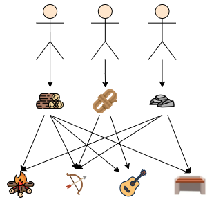

## A Basement Dweller's Econ 101
 
#### What Econ 101 Means

Economics is the study of the allocation of scarce resources that have alternative uses.

The fact of scarcity means that the ammount of resurces is limited, so that their use in the production of X necessarily means they cannot be used in the production of Y

This means societies must develop mechanisms to EConomize these resources, that is, to not use them in wasteful ways. We want them to be assigned to their most valuable uses, that is, we want the allocation to be economically efficient. 

cdcdcdx