

---

# CLASSICAL MACROECONOMICS

---

## Say's Law 

- The discipline of Macroeconomics can be described as the study of an economic system as a whole, as opposed to the study of individual markets (which is the perview of Microeconomics). Just as demand and supply are the most essential concepts in Microeconomics, in the context of Macroeconomics we refer to the concepts of ***Aggregate Supply*** and ***Aggregate Demand***, being each respectively the aggregate of all individual goods supplied and demanded in the economy.
  
- Classical Economics' understanding of the concepts of ***Aggregate Supply*** and ***Aggregate Demand*** is underpinned by what has come to be known as ***Say's Law of Markets*** (named after the French economist Jean-Baptiste Say). There appear to be many definitions of Say's Law, with the most popular owing to John Maynard Keynes, and stating it as the principle that "Supply Creates it's own Demand". We can think of these different definitions as the corollaries and implications of the underlying principle that Say was trying to convey, and which is presented below: 

---

#### Goods Exchange against Goods

---

- To illustrate the point, we can assume we live in a barter economy. In such a situation, the only way to acquire goods from other people is to produce goods that they will want in exchange. What Say emphasized was that this does not stop being true when we move to a monetary economy. ***In any economy, our production is the source of our purchasing power***.

- While what we are saying is seemingly tautological, there are in fact a lot of non obvious implications that can be derived from this simple statement, some of which have been presented as alternative definitions of Say's Law. These include:  
  - People only produce for the market (increased supply) because they want to earn an income. Insofar as they do, that iself signals they want to spend (increased demand). Put bluntly, ***to supply is to demand.*** 
  - Total factor payments received for producing a given volume of output are necessarily sufficient to purchase that output.
  - The only valid concept of demand is that of **real demand** (purchasing power), which can only be increased by increasing the productive capacity of the economy.
  - In a Free Market, there cannot be a general glut, and small gluts are only temporary and self-correcting.

- From the standpoint of the concepts of **Aggregate Supply** $(\red{SS})$ and **Aggregate Demand** $(\textcolor{darkcyan}{DD})$ that concern us here, Say's Law can be symbolically elucidated as follows:

$$\textcolor{red}{SS} \Rightarrow	 \textcolor{darkcyan}{DD}$$

- This means that ***aggregate supply is the source of aggregate demand and that they must always necessarily equal each other***. 

- The general point is that while it is sensible to treat supply and demand as separate concepts when analyzing a single market, in the aggregate they become indistinguishable. We can treat the demand for a product as independent of it's supply and vice-versa, and analyze shifts in the demand curve and supply curve for that product as occuring independently of each other. Macroeconomically, however, Aggregate Demand cannot be treated as somehow exogenous to Aggregate Supply, so that speaking of concepts such as an aggregate "underconsumption" or "overproduction" becomes nonsensical. 
  

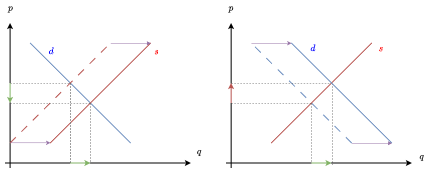

- If we were to attempt to represent this principle in the language of standard supply & demand analysis, we may do it as below. Here, the aggregate supply curve is vertical, which opposes any notion that the price level $P$ has any effect on the quantity produced. Aggregate supply is only a function of the productive capacity of the economy (by which classical economists would mean the productivity of labor) and only by an increase in this productive capacity can it be shifted. 

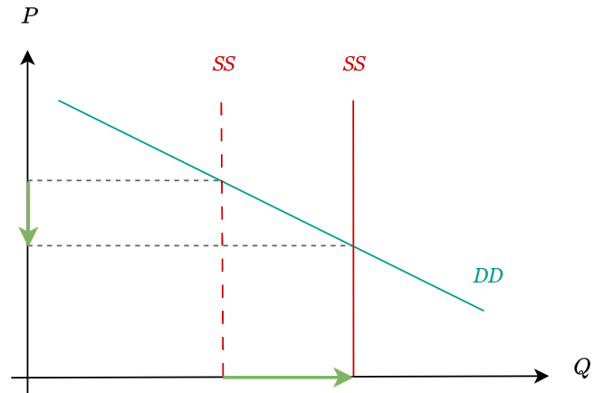

- Furthermore, Aggregate Supply is the only one of the curves that can be meaningfully *shifted*. From the standpoint of Classical Economics, Aggregate Demand is *real* demand (purchasing power, as opposed to spending in terms of monetary units). As the productive capacity of the economy increases, output increases, making prices fall and hence increasing the real purchasing power of the population. The Aggregate Demand curve is *fixed* because it's just meant to illustrate this fact. It is not defined as a *will to purchase* by the public, but as ***aggregate supply at a given price level***. 

$$\textcolor{darkcyan}{DD} = \textcolor{red}{SS}.P$$

## The Classical Labor Market

- For british classical economy, the ***savings*** by businessmen constitute a ***wage fund*** that makes up the **Demand for Labor** $(\orange{D_L})$. Hence **Nominal Wage Rates** $( \orange{W} )$, that is, *wages in terms of money*, will be directly proportional to this demand for labor and inversely proportional to the **Supply of Labor** $( \red{S_L} )$. 

$$\textcolor{darkorange}{W} = \frac{\textcolor{orange}{D_L}}{\textcolor{red}{S_L}}$$

- In short, the more labor units to be employed for a same wage fund, the lower nominal the nominal wage rates of those laborers. The demand for labor slopes downwards because for a given wage fund, the higher the wage rate is, the less labor units businessmen will be able to employ.

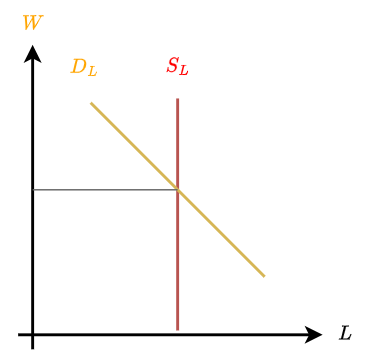

 

- Why do we take the aggregate supply of labor to be vertical? This is because we are taking into account the value of ***leisure***. The ammount of hours people are willing to work is not a function of the wage rate, but of the wage rate in relation to the value of leisure. At some point, people will use higher earnings as an opportunity to work less and enjoy more leisure. If we consider both effects to be mutually ofsetting, then we can approximate the labor supply curve as vertical.

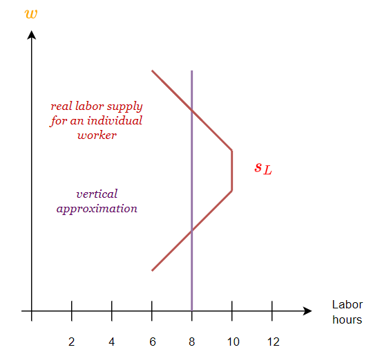

  
-  The intersection of these two curves will determine the height of nominal wage rates and the ammount of labor units employed in the economy. **Real Wage Rates** $( \red{\omega} )$, that is, *wages in terms of purchasing power*, will be nominal wage rates divided by the **General Price Level**  $P$, which as we saw above relates **Aggregate Supply** $(\textcolor{red}{SS} )$ to **Aggregate Demand** $(\textcolor{darkcyan}{DD})$.

$$\textcolor{red}{\omega} = \frac{\textcolor{orange}{W}}{P} = (\frac{\textcolor{orange}{D_L}}{\textcolor{darkcyan}{DD}}) \cdot (\frac{\textcolor{red}{SS}}{\textcolor{red}{S_L}})$$

- In the classical labor market, unemployment can only exist by fixing nominal wage rates at a level too high for the labor demand to clear given a certain volume of the wage fund. Hence, the means to achieve low unemployment is through allowing nominal wage rates to fall to the point where business can hire all the labor supply. 

$$\textcolor{orange}{W} \downarrow \ \ \rightarrow \ \ \textcolor{red}{S_L} \uparrow$$

- This kind of conclusion of classical economics was treated by many commentators as to imply an anti-labor bias by bourgeois economists. The reality is that if we take real wages to be the meaningful measure of living standards for workers, then the fact the new hired labor increases aggregate supply means the price level falls and hence there is no fall in real wages. The conclusions of the classical economists are then value-free and scientific, merely elucidating how a dislocation between the size of the wage fund and given nominal wage rates is corrected in a free market. 

$$\textcolor{red}{\omega_2} = \frac{\textcolor{orange}{W}\downarrow}{P \downarrow}  \approx \textcolor{red}{\omega_1}$$

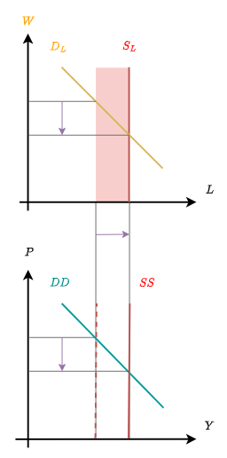

## Investment & Interest Rates

- There were competing theories of interest within Classical Economics, with the two main rivaling theories being the ***Time Preference*** theory of interest and the ***Productivity*** theory of interest. Instead of going into a tangent about what the ultimate nature of interest is, we can integrate both positions into a single framework that states that the interest rate $\textcolor{green}{i}$ is determined by the ***supply of savings*** $(\textcolor{red}{S})$ by the public and the ***demand for investment*** $(\textcolor{red}{I})$ by businesses. 

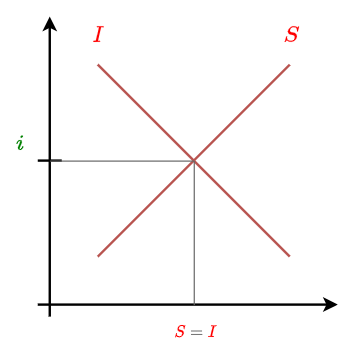

- The supply of savings $\textcolor{red}{S}$ slopes upwards because the higher the interest rate, the more people are enticed to save. A rise in people's time preference or future orientation will shift this supply rightwards and lower the interest rate (since people are more future oriented, they are willing to accept a lower interest rate for the same ammount of savings).

- The demand for investment $\textcolor{red}{I}$ slopes downwards because the lower the interest rate, the more money people will demand for business projects. A rise in productivity will shift this demand rightwards and raise the interest rate (there are more profitable projects to invest in, so people are willing to pay a higher interest rate for the same investment).

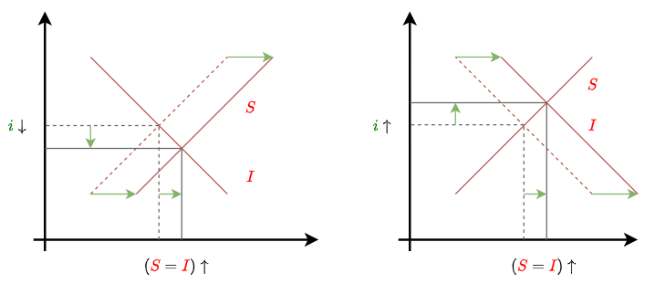

- A given volume of savings/investment will determine the rate of capital accumulation in the economy, that is, the rate of growth of the economy's ***Capital Stock*** $K$, which is a measure of the total value of capital equipment (e.g tools & machinery), hence of the productivity of labor and therefore directly proportional to aggregate supply in the economy. 

$$(\textcolor{red}{S}=\textcolor{red}{I}) \propto \frac{\Delta K}{\Delta T} \propto \frac{\Delta \textcolor{red}{SS}}{\Delta T}$$

---

*Note: The Algebraic symbol $\propto$ means "is proportional to" and $\Delta$ stands for "change in", so that $ (\textcolor{red}{S}=\textcolor{red}{I}) \propto \frac{\Delta \textcolor{red}{SS}}{\Delta T}$ reads as "a given volume of savings/investment is proportional to the rate of growth of aggregate supply (that is, the magnitude of the change in aggregate supply for a given period of time)*

---

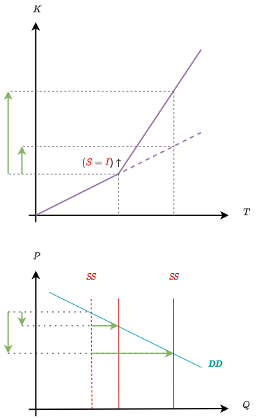

## Money 

- Classical economists views on money allign with what we currently know as the **Quantity Theory of Money**. Roughly speaking, they believed that the **Price Level** ($P$) was a direct function of the quantity of money, by virtue of the fact that the Supply of Money ($M_S$) is a direct determinant of total spending in the economy.

- More generally, Classical Economists understood money to be a commodity just as any other, and hence it's value was determined by the same principles of supply and demand. Given that money is the commodity against which we measure the value of everything else, it follows that the more money there is in the economy, the less scarce it is, the more it's price falls, and hence the higher the price of everything else. 

$$\textcolor{red}{SS}.P = \textcolor{darkcyan}{DD} \ \ \land \ \ \textcolor{darkcyan}{DD}=\frac{M_S}{M_D} $$

$$P = \frac{M_S}{\textcolor{red}{SS}.M_D}$$

- Classical Economics would implicitly or explicitly assume money to be ***neutral***, in the sense that *in the long run* a doubling of $M$ would just double prices without affecting real variables like output or employment. A summary statement of the classical system under an increase in the money supply may be as follows:

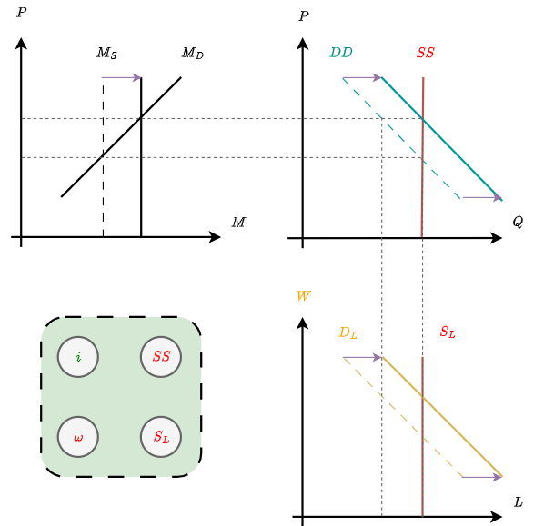

- Here, we see that an increased money supply raises wages and prices in the same proportion. Aggregate demand (that is, Aggregate Supply), the supply of labor and real wages remain unchanged. The interest rate is also unchanged since, as mentioned above, it is a function of time preference and the productivity of investments, neither of which are themselves a function of the quantity of money in the system. 

## Appendix 1 - Say's Law & Relative Overproduction

- Say's Law has been passed down to us as the idea that "Supply Creates it's own Demand". However, Say never stated that an increase in the supply of a particular industry would lead to an increase in the demand for the products of that industry. Instead, what Say's Law states is that more supply in the economy as a whole creates more real demand (purchasing power) in the economy as a whole. 

- In order to show this, we will start from an example that refutes the strawmanned version of Say's Law, only to show how that very example ultimately confirms the true version of Say's Law.

- Let us take the example of potatoes. This is a good of which we have plenty of and are unlikely to need much more of. In terms of the theory of supply and demand, this means it's demand is quite inelastic. Thus, a representation of the potato market may look as follows

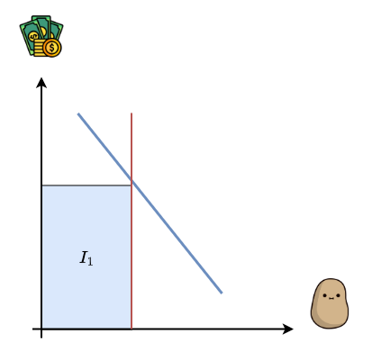

- If some kind of new machine or technology is invented, so that now potato producers can produce twice as much potatoes for the same costs, then they will raise their output expecting to make even more money. However, because people already have quite enough potatoes, this will have turned out to be an entrepreneurial mistake which causes a *glut* of potatoes in the market. There is an excess of supply which will have to be sold at a lower price for the market to clear.

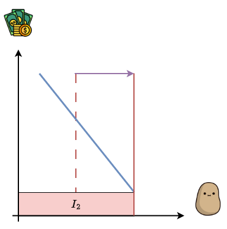

- Thus the potato business became *less profitable* as an outcome of ain increase in it's physical productivity. Because the new income to producers does not allow them to cover their costs, while at the same time the new technology will be kept in place (since it provides a competitive advantage to anyone who holds it), this means that potato producers will have to cut down their scale (e.g by having sub-marginal producers abandon the market or by laying off workers). This will constrain aggregate supply to a point where the potato business becomes profitable yet again. 

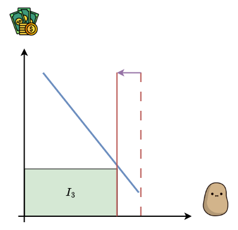

- Here we have precisely illustrated an example of an increase in supply not only not increasing demand, but leading to a reduction in it ($I_3$<$I_1$ means people spend *less* on potatos under the new equilibrium). Hence, this is a direct a refutation of the strawman version of Say's Law that merely says that an increase in the supply of a product creates the demand for that product. Yet, the only thing Say's Law states is that more supply in the economy as a whole creates more real demand in the economy as a whole. However, more supply ***has been created*** in this example, since the potato producers ***did increase*** their productive capacity. So is the real Say's Law playing out in this example?

- The answer is *Yes!* From the side of supply, the increases in productivity mean the same output can be produced with less factors of production. That means there has been a freeing up of resources in terms of labor, capital and entrepreneurial creativity, one that can now enter the economic system in the manner of producing other goods. From the side of demand, people now have more disposable income due to the lowering of the price of potatoes, and can now channel this gained income to the buying of other goods. Hence, taking the system as a whole, both aggregate supply and aggregate demand have increased, and in the same proportion.

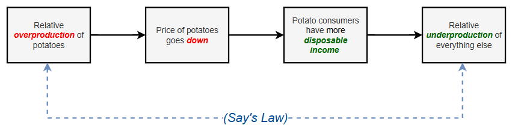

- Stated in the language of neoclassical microeconomics, we can say that an increase in the supply of a particular industry can have two effects:
  - ***If The Industry has high demand elasticity***, the demand is increased ***directly*** trough people being able to buy more of it's produce.
  - ***If The Industry has low demand elasticity***, the demand is increased ***indirectly*** by means of the freeing up of resources on the side of production and increased disposable income on the side of consumption.

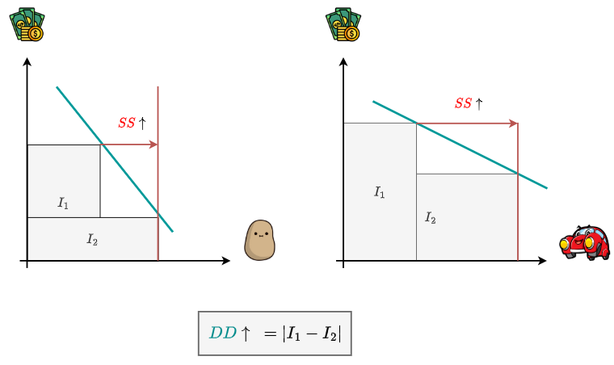

  
- In short, an increase in the supply of a particular industry means either directly or indirectly an increase in the ammount of goods the entire economy can produce, and hence an increase in ***real demand*** or purchasing power in the economic system as a whole. 

> ---
>
> Supply of wheat gives rise to demand for automobiles, silks, shoes, cotton goods, and other things that the wheat producer wants. Supply of shoes gives rise to demand for wheat, for silks, for automobiles, and for other things that the shoe producer wants. Supply and demand in the aggregate are thus not merely equal, but they are identical, since every commodity may be looked upon either as supply of its own kind or as demand for other things. 
>
> - Benjamin M. Anderson - Economics and the Public Welfare
>
> ---

## Appendix 2 - Say's Law and General Overproduction / Underconsumption

- In the previous example we showed how Say's Law can be understood as a demonstration of the proposition that in a free market there can be no long-run *gluts* of production, as these are quickly corrected by the profit-loss mechanism. The more unlikely then that there can be a ***general*** glut of supply in the system as a whole. 

- Theories that have argued for the cause of recessions as being due to an excess of aggregate supply over aggregate demand are called ***Underconsumptionist / Overproductionist*** theories. The essential view is illustrated below, where we see a rise in the productivity of labor leading to an increased aggregate supply. The system, however, does not create enough aggregate demand to absorb this aggregate supply, leading to a recession and/or general unemployment as business have to scale down their activities.

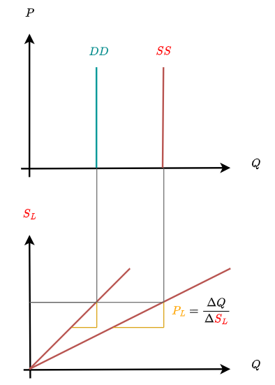

- In the previous section, we implicitly assumed that whenever resources are freed up as a consequence of increases in productivity, these resources would eventually find new ways to be employed and, to that extent, there will exist new ways to spend the disposable income created by this increase in productivity. This means that in the aggregate and in the long run, there could not be any dislocation of aggregate demand and supply. It is important to clarify why this assumption is entirely reasonable: 
  - We all can think of ways in which we would spend additional income ***if we just had it***. The person who is reading this is currently more likely than not saving to buy something, which means he would automatically buy it if he had access to additional income. At the very least, any of us can think of things that we would like to buy but simply cannot because we have to economize our income.
  - The point being that ***the demand for wealth always exceeds the current level of wealth***, so that ***there is not a limited stock of "work to be done"*** that could be depleted. Labor is the fundamentally scarce resource because it must be employed in any productive process, and hence ***to the extent there is an unlimited demand for wealth, there is an unlimited demand for labor***.
  - ***What limits aggregate supply, then, is not our desire for goods, but the productive capacity of the economy***, which is in a way the ammount of human effort that requires to be put in to produce the goods and services that we demand. All of us would willingly accept having twice as much income, but few of us would accept this for twice as much effort. 
  - This proposition, that our demand for wealth always exceeds our capacity to produce it, has almost metaphysical validity: The demand for wealth requires nothing of us while it's production actually requires effort, so that there is only so much wealth we can produce as compared to the ammount of wealth we want. It is only because we cannot have everything we want that we have to *economize* our income, prioritize some of our needs over others, and hence make economic decisions.

- Having said all of this, it's important to clarify that the validity of Say's Law does not hinge on the supposition of an infinite demand for wealth: To the extent that a person can be completely satisfied with his income, and indeed has absolutely no desire for further wealth, then that person has no reason to participate in the productive process (since he would be doing it for an income he doesn't desire). As implausible as that situation is, if indeed there was a large volume of people that desired not to spend any further, for the same reason those people would exit the productive process (either absolutely or by reducing their working hours), reducing aggregate supply to that extent, so that here once again aggregate supply catches up to aggregate demand, in this case by means of the ***reduction*** of both in equal proportions.

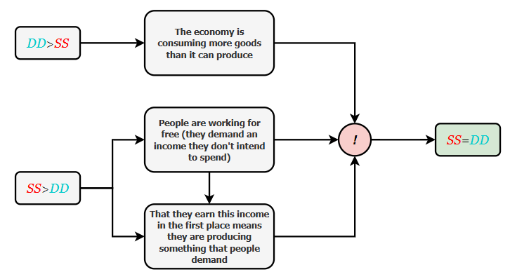

Every instance of separation of $\textcolor{red}{SS}$ and $\textcolor{darkcyan}{DD}$ is an instance of maladjustment.

## Appendix 3 - Say's Law and Business Activity as the Source of It's Own Profitability 

- If we take the perspective of any individual business, it becomes clear that this business desperately needs consumers to buy his products in order to keep afloat. Generalizing to the entire economy, there would appear to be a macroeconomic dependance of businesseses on consumers. Given this dependance, it is not unreasonable to conclude that boosting consumer spending would have the result of stimulating business activity.

- While we will have time to explode this fallacy in detail in our critique of Keynesianism, we may note that a consistent application of Say's Law is already enough to realize it's fallacious nature: What turns what a business earns into income is not the fact that consumers buy his produce, but rather the fact that these consumers have produced things that the business owner will want to buy with the income he earns from his produce. Absent this condition, any income the business owner earned would be worthless (since he would not be able to buy anything with it). 
  
- In short, the proposition that businessess need consumer demand to sustain their activities is only true insofar as it carries with it the implicit assumption that this demand is ***real demand*** in the classical sense. This real demand that is an outcome of supply is what makes the income earned by the business meaningful, so that it is not spending itself that sustains business activity, but rather other business activity. This proposition,  that ***business activity is self-sustaining*** and doesn't hinge on the degree to which people want to spend, seems confusing only to the extent that we ignore Say's Law, which shows that ***demand is always guaranteed to the extent that people are engaging in production***. A community that had no desire to consume would for that same reason not be engaging in production for the market. ***Consumer demand as a phenomena is not contingent on people's will to consume (which can be taken for granted), but in people's capacity to produce (which cannot)***. To the extent that capacity exists, the phenomena of consumer demand will always be present, and hence business activity will always be able to produce a demand that is enough to buy it's entire supply. ***There is no reason to believe that consumer demand will not be sufficient so that it need be boosted exogenously to keep the economy afloat***.

> ---
>
> *"The Real national income is the goods and services produced to satisfy the nation's wants. It is this that land, labor and capital produce, and it is with this that land, labor and capital are paid. Any increase in the product is an increase in the payments. It is only because our exchanges are made trough money that we have any difficulty in perceiving that an increase in supply **is** (not 'causes' or 'enables') an increase in demand"*
> 
> - *Henry Clay - Economics, an Introduction for the General Reader*
>
> ---

## Appendix 4 - Say's Law and the Classical Understanding of Recession

- Classical Economics understood recessions to owe to an ***aggregate fall in the profitability of business activity***. To make sense of this proposition, we may approach aggregate profits as the result of the difference between two aggregate demands: the demand for the products of businesses and the demand for factors of production by businesses. We can represent the components of these two aggregate demands as follows:

| Aggregate Demand for the Products of Businesses | Aggregate Demand for Factors of Production by Businesses |
| --- | --- | 
| Sales Revenues from Consumers | Demand for Inputs, Services & Capital Goods  |
| Sales Revenues from Other Businesses | Demand for Labor | 

- Since the demand for inputs, services and capital goods are expenses paid to other businesses, they show up as sales revenues to those businesses, which means they cancel out at both sides of the inequality. Then, given that wage earners, in their condition as wage earners, do not engage in the buying of factors of production, all wage payments will become consumer demand. It follows that aggregate profits exist to the extent that:

$$\textcolor{blue}{D_C}+\textcolor{red}{D_B}>\textcolor{orange}{D_L}+\textcolor{red}{D_B}$$

$$\textcolor{blue}{D_C}>\textcolor{orange}{D_L}$$

- The meaning of this expression is that aggregate profits manifest as a *surplus of consumption* in the economy, owing to the consumption of businessmen and capitalists $(\textcolor{blue}{D_C}-\textcolor{orange}{D_L})$. Importantly, from the standpoint of classical economics this surplus consumption does not exist on account of their desire to consume (which, as per Say's Law, could be taken for granted) but on account of their ability to make their sales revenues exceed their costs of production. The connection between aggregate profits and aggregate consumption in the classical framework may be sketched as follows:
  

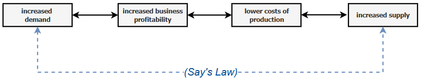

- While this theory of profit cannot be said to be entirely correct (given that it relies too heavily on the notion of objective costs of production), it is nevertheless extremely germaine to refute a mistaken interpretation of the history of economic thought that suggests Say's Law as being a theoretical device used by classical economists to deny the possibility of recessions or business cycles. The reality is quite the opposite: What little understanding of business cycles and recessions classical economists had, they owed it precisely to Say's Law, since it allowed them to pin their causes on shifts in the aggregate profitability of business activity, as opposed to shifts in people's willingness to consume, save, invest or hold money.

- As outlined above, classical economists understood that consumer demand and aggregate profits ***were*** inextricably linked, yet crucially due to Say's Law ***the relation of causality was understood to be from profits to consumption***, not the other way around. A businessman who pursued an unprofitable venture would have his costs of production exceed his revenues and thus destroy his capacity to consume to that extent. Conversely, a businessman who wanted to increase his consumption would have to find a way to increase the difference between his revenues and his costs of production. This net destruction or net creation of Aggregate Supply / Aggregate Demand was contingent on the businessman's ability to create value, which once existing could then be claimed as additional consumption. A recession, then, was understood as an aggregate fall in the profitability of business activity, that is, a net destruction of value which led to a fall in Aggregate Supply / Aggregate Demand to that extent.
  
- In short, while it is true that Classical Economics was flawed in it's understanding of recessions, since it never developed a complete theory of Business Cycles and relied on mistaken concepts such as the idea of objective costs of production, it at least had the merit of understanding that the causes of recession were to be sought in an aggregate fall in the profitability of business activity, of which a fall in consumption was only a derivative phenomena. 

> ---
>
> *"Mistakes may be made, and commodities not suited to the demand may be produced - of these there may be a glut; they may not sell at their usual price; but  then this is owing to the mistake, and not to the want of demand for production. For every thing produced there must be a proprietor. Whoever has produced a commodity is necessarily a demander: either he wishes to consume the commodity himself, and then no purchaser is  wanted; or he wishes to sell it and purchase some other thing with the money. The commodity he possesses will obtain him this or it will not. If it will, the object is accomplished, and his commodity has found a market. If it will not what does it prove? that he has not adapted his means well to his end, he has miscalculated. What I wish to impress on the readers mind is that it is at all times the bad adaptation of the commodities produced to the wants of mankind which is the specific evil, and not the abundance of commodities or any lack of want for commodities."*
> 
> - David Ricardo, *Principles of Political Economy and Taxation*
>
> ---

## Appendix 5 - Say's Law and the Logical Necessity of Rising Living Standards under Capitalism 

- Having framed says law in the formal language of demand elasticities, it is interesting to point out that those goods that are more likely to become "overproduced" as a result of the increased productivity are most likely goods that represent needs that are already covered. On the other hand, it is goods of a higher order that are currently beyound our reach that are more likely to rise in demand as our income increases.
  
- As we showed in our example above, if the productivity in the manufacturing of cars is doubled, that will lead their prices to be reduced, allowing more people to buy them. If on the other hand the productivity in the production of food & clothing doubles, their falling prices won't lead people to eat twice as much or have a second wardrobe, but will instead allow them to have a disposable income that they can spend on cars. In either case, the economy will be producing more of what was hitherto a luxury good. It follows that an economy that works under a profit motive and is successfull in increasing productivity year by year ***must*** raise the living standards of it's population and specially of those who at any time are "at the bottom", almost as a manner of logical necessity.

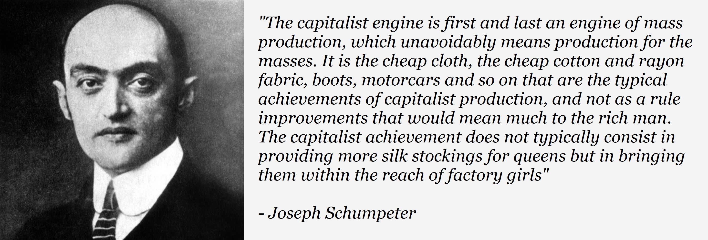

---

## Quiz Time!

#### Why is Aggregate Demand larger in Japan and The United States than in Uganda or Venezuela?
  A. The United States and Japan are filled with degenerate consoomers that can't stop buying products, hence their aggregate demands are larger. 
  B. Ugandans and Venezuelans choose to forego a life of frail consumption and as such reduce their aggregate demand to that extent.
  **C. The United States and Japan are greater demanders of goods because they are greater producers of goods, and as such can satisfy their needs to a greater extent.**

#### What is easier: earning a paycheck or spending a paycheck?
  **A. Spending a paycheck is easier. Finding a job is hard and keeping it takes effort, but I do it because I want the paycheck.**
  B. Earning a paycheck is easier. Finding a job is an effortless process. Spending my paycheck, on the other hand, is a daunting task. 

#### Does consumer demand need to be boosted exogenously for business activity to remain profitable?
  A. Yes, always.
  B. Maybe sometimes.
  **C. No. Never. Only morons believe that.**

#### Are sales dull because money is scarce?
  A. Yes. If we had more money there would be more sales, so that we can say that if business are not selling enough it is because people do not have enough money to spend. If we gave people more money, we would increase sales and consequently production and employment. 
  **B. "Sales cannot be said to be dull because money is scarce, but because other products are so. To use a more hackneyed phrase, people have bought less because they have made less profit. It is not the abundance of money but the abundance of other products in general that facilitates sales. Money performs no more than the role of a conduit in this double exchange. When the exchanges have been completed, it will be found that one has paid for products with products" - J.B Say**

